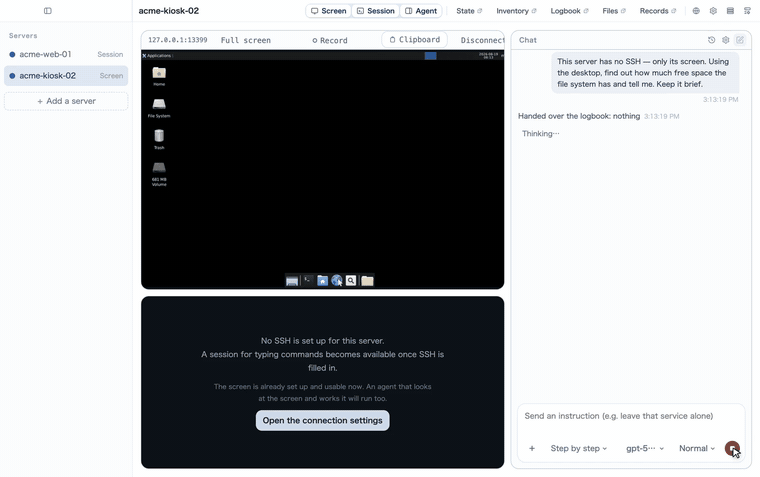

# Machina Forge Ops

[English](README.md) · [日本語](README.ja.md) · **简体中文** · [繁體中文](README.zh-Hant.md)

一个用于远程维护客户服务器的桌面应用。**屏幕**（RDP 或 VNC）、**终端**（SSH），以及**两者都能用的智能体**，
在同一个窗口里。

它来自一件很具体的麻烦：远程桌面、终端、和模型的对话本来是三个各自独立的程序，要分别连接、分别提问。
这里把这三件事放在了一处。

**客户的服务器上什么都不安装。** 一切都通过本来就存在的连接读取；**读不到的东西不猜，直接写在屏幕上。**


*一个窗口，一台服务器：RDP 的桌面、SSH 的终端，以及旁边的智能体。监控告警是原样贴进去的。* **[两分钟看完整次运行（视频）](https://github.com/inexus-co/machina-forge-ops/releases/tag/demo)**

## 它能做什么

- **屏幕**：RDP 走我们自己的 helper（`native/rdp`），基于 FreeRDP，只把变化的矩形通过 fd 3 送出来 ——
  没有窗口、没有 X11、没有常驻进程。VNC 则直接用 TypeScript 实现。**没有 SSH 的服务器不等于碰不了的服务器**：
  智能体会读屏幕并操作它 —— 点击与按键 —— 每一个动作都会停下来等人，并连同当时瞄准的画面一起进记录。
- **终端**：SSH（`ssh2` 与 `xterm.js`）。配合 `tmux`，关掉应用之后工作仍在继续。
  正在看着什么？**可以把这个会话交给聊天**：屏幕上的内容会作为你自己的话、加引用并注明来源送给智能体，也进记录。
- **智能体**：Pi（`@earendil-works/pi-coding-agent`）。可以注册多个模型，每次运行时选一个。
  每个具名智能体都有自己的模型、自己的审批方式，以及单次运行可用的命令数上限。
- **委派**：一个智能体可以把工作交给另一个。被委派的一方用自己的模型运行，只允许一层，命令数上限与父级共享，
  所有审批与记录都汇总到父级。
- **状态、构成、文件**：都从已经打开的 SSH 连接上读取，对端不留任何东西。
- **服务器台账**：操作者写下的内容、过去运行留下的交接、这台机器读到的事实 —— 一并交给下一次运行，
  这样没有人需要从零开始。
- **插件**：针对反复遇到的服务器形态（LAMP、Nginx、Docker、PostgreSQL）的现成知识，以及在不猜路径的前提下
  摸清一台陌生机器的做法。插件是一组技能；带 goal 的技能同时也是聊天框 ＋ 菜单里的命令。可以从本机的
  文件夹添加 —— **不会去网络上取任何东西。**



*一台**完全没有 SSH** 的服务器。智能体读屏幕并操作它；每个动作都停下来等人，记录里留下每一次的前后对比。*

## 安全

每一条命令按顺序穿过四层：

1. **形状**。不允许 `;`、`&&`、`|`、`>`、反引号和换行，也不允许把命令写成路径。
   一行一条命令，否则不执行。
2. **底线**。`sudo`、具有破坏性的、指向设备的，以及会遍历整台机器的读取，**永远停下来等人。**
   任何设置、任何记住的例外都不能让它松动。
3. **目录**。约六百条命令由人工分类为读、写、动词、代码、shell，另加各发行版自己描述的全部命令。
   读的直接跑，写的停下，shell 被拒绝，**没有人判断过的会停下并说明。**
4. **操作者自己的例外**。按安装、按服务器，在工作过程中从审批卡片上做出。


*这是一次真实的运行。带管道的命令被直接拒绝，`sudo` 一条一条审批，看起来像密码的内容既没到模型，也没进记录。*

每条命令和它的全部输出都进入运行记录。任何看起来像凭据的内容，在到达模型或记录之前就从输出里去掉了 ——
键名保留，所以智能体能看到"密码已设置"，却永远看不到那个值。

凭据（服务器密码、密钥口令、模型 API key）保存在主进程一侧的加密存储中，**永不回到界面上。**
留空保存，就继续用已经存好的那一份。

**模型做计算的地方是你的机器，不是客户的机器。** 智能体在这里拿到的是一个真正的 shell —— 管道、重定向、
脚本都可以 —— 但它在沙箱里：只能写入本次运行的工作目录，读不到你的 home，也没有网络。
到达服务器的，始终只有经过上面四层的**一行命令**。


**修改文件有一套固定流程。** 取回真实的文件（**你的机器上也留一份带哈希的副本** —— 只放在待修机器上的
备份，会跟那台机器一起消失），在服务器上也做一份备份，新内容在沙箱里生成，然后
**把差异和新文件全文放到审批卡片上 —— 任何模式下都会问，自动模式也不例外**。写入之后，
先跑软件自己的检查（`nginx -t` 这类，也是一行），再去重载。

## 为什么这样设计

这些决定的记录，连同它们的代价和被否掉的方案：

- [ADR 0001 — 智能体可以拥有 shell，但要在专为这条路径写下的保证之下](docs/decisions/0001-shell-under-a-written-guarantee.md)
- [ADR 0002 — 代码在我们这一侧运行，目标机只接收可审计的输入](docs/decisions/0002-code-runs-on-our-side.md)

两份都是英文。它们是上面四层、沙箱与文件流程背后的论证，并且明确写出**每一项在什么地方会失效**。

## 它保护不了什么

- **屏幕操作的智能体没有许可名单。** 只要桌面上有一个终端窗口，它就能往里敲任何东西，上面四层一层都不起作用。
  所以一次运行要么走屏幕、要么走 shell，绝不同时持有；屏幕这条路只为完全没有 SSH 的服务器而存在
- **许可名单只会像分类它的人那样聪明。** `find -exec` 和 `-delete` 会被扫描参数拦下，`awk` 和 `sed` 被当作代码
  在目标机上直接拒绝。但**还没有人想到的逃逸口**，在有人把它分类之前会一直通过。发现了请告诉我们
- **它挡不住提示注入。** 智能体读到的东西 —— 一行日志、一个配置文件、一个文件名 —— 都会进入模型，其中的文字
  可以是指令。限制损害的是这些关卡，而不是模型的判断力：没分类过的不会跑，需要提权的没有人不会跑。
  但被污染的日志仍然可能让它提出一条**看起来合理、也可被批准**的命令，最后一道防线是读卡片的人
- **审批疲劳是真实存在的。** 自动模式正是因此存在；要不要开，是操作者按服务器做的取舍
  （即便开了，底线 —— sudo、破坏性操作、设备 —— 仍然会停）
- **沙箱只能强到这台机器的系统允许的程度。** 在没有任何隔离手段的机器上 —— 既无 WSL2 也无 Docker 的 Windows ——
  本地 shell 干脆不提供。只有在明确承担责任时才有例外：默认关闭、逐条审批，并在记录里写明"没有墙"
- **它不是监控系统。** 它是在有人正在处理这台机器时去读它。一周的曲线、凌晨三点的告警需要常驻的东西，
  那是另一种产品

## 语言

界面有英语、日语、简体中文、繁体中文，在设置里选择，切换无需重启。
源码是英语的：代码里的每一句话都用英语写，再在 `src/shared/messages/` 里翻译；漏翻会让测试失败。
交给模型的提示里，只有一行跟随操作者的语言 —— 告诉它用哪种语言回答。

## 开发

```bash
yarn install
yarn dev          # 运行
yarn typecheck
yarn test         # 单元与集成
yarn build
```

RDP helper 需要针对运行它的机器构建，开发时屏幕也依赖它
（需要 FreeRDP 3：`brew install freerdp`）。

```bash
native/rdp/build.sh
```

## 打包

```bash
yarn dist:mac     # dist/ 下的 dmg 与 zip，arm64 与 x64
yarn dist:win
yarn dist:linux
```

打进去的东西：helper 本身，以及它需要的 FreeRDP 库（`bundle.sh` 会把它们改写成 `@loader_path`）。
每次打包都重新构建，只要还指向外部的库就不打包 —— 发一个没有屏幕的应用，好过发一个打开就崩的应用。

**没有签名。** 用的是 ad-hoc 签名，能启动，但在别的 Mac 上第一次会提示无法验证开发者。
右键 → 打开 一次，或者用 `xattr -dr com.apple.security.quarantine <应用>` 清掉。
要正经分发需要 Developer ID 证书和公证。

Windows 与 Linux 的包里没有 RDP 屏幕：Windows 的 helper 还没写（`build.sh` 不涵盖），
Linux 的仍然依赖那台机器上的 FreeRDP。SSH 终端、文件和智能体在两边都能用。

集成测试会真的连接一个容器；没有容器时会安静地跳过。

```bash
docker compose -f native/rdp/test-server/compose.yaml up -d --build
```

## 技术栈

Electron / React / TypeScript / electron-vite / FreeRDP（经由自己的 helper）/ ssh2 /
xterm.js / Pi coding agent

## 许可证

GNU Affero General Public License 第 3 版或更新版本。全文见 [LICENSE](LICENSE)。

实际含义：**使用它不对你提出任何要求** —— 包括用它有偿维护别人的服务器。
**当你修改它并让别人使用你修改后的版本时**（作为程序，或通过网络），
这些人必须能够拿到你的源码。
