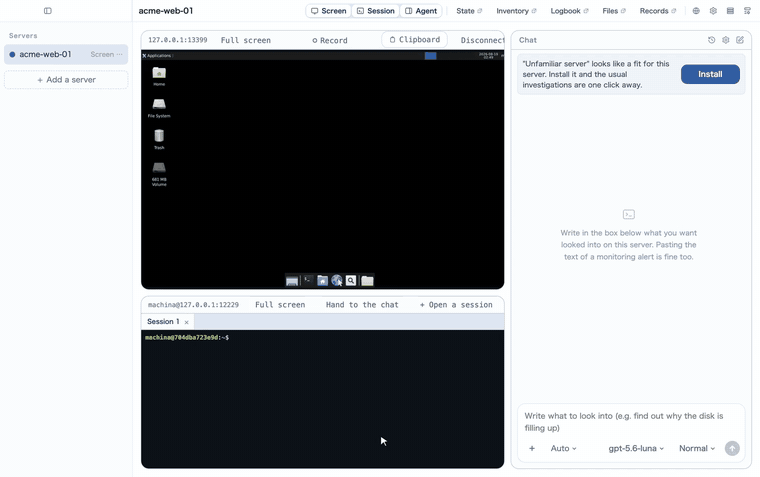
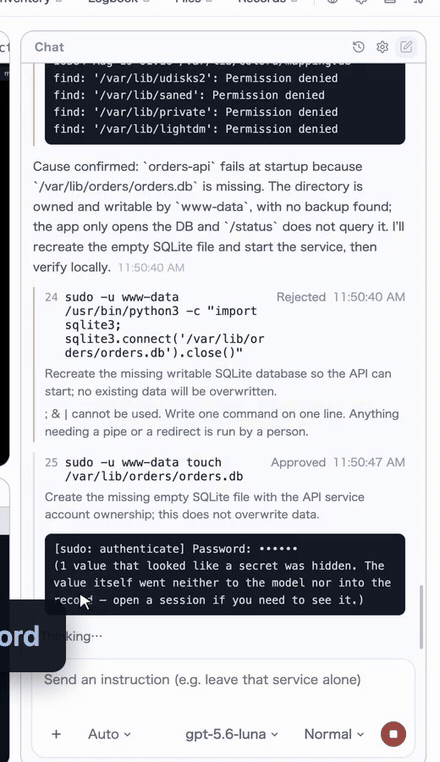
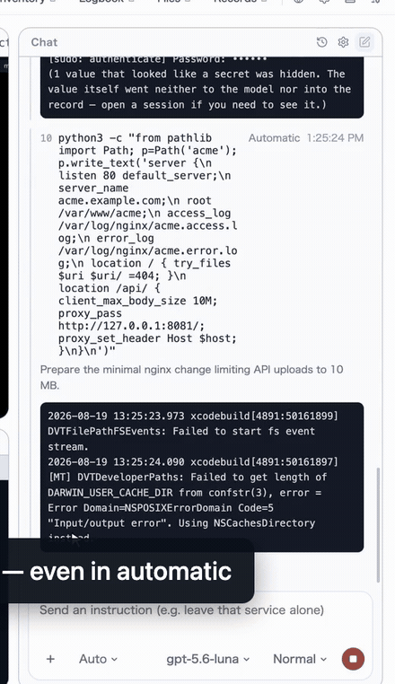

# Machina Forge Ops

[English](README.md) · [日本語](README.ja.md) · [简体中文](README.zh-Hans.md) · **繁體中文**

一個用於遠端維護客戶伺服器的桌面應用程式。**畫面**（RDP 或 VNC）、**終端機**（SSH），以及**兩者都能使用的
代理**，都在同一個視窗裡。

它來自一件很具體的麻煩：遠端桌面、終端機、以及與模型的對話原本是三個各自獨立的程式，要分別連線、分別詢問。
這裡把這三件事放在同一個地方。

**客戶的伺服器上什麼都不安裝。** 一切都透過本來就存在的連線讀取；**讀不到的東西不猜，直接寫在畫面上。**



*一個視窗，一台伺服器：RDP 的桌面、SSH 的終端機，以及旁邊的代理。監控告警是原樣貼進去的。* **[兩分鐘看完整次執行（影片）](https://github.com/inexus-co/machina-forge-ops/releases/tag/demo)**

## 它能做什麼

- **畫面**：RDP 走自己的 helper（`native/rdp`），以 FreeRDP 為基礎，只把變動的矩形透過 fd 3 送出 ——
  沒有視窗、沒有 X11、沒有常駐程序。VNC 則直接以 TypeScript 實作。
- **終端機**：SSH（`ssh2` 與 `xterm.js`）。搭配 `tmux`，關掉應用程式之後工作仍會繼續。
- **代理**：Pi（`@earendil-works/pi-coding-agent`）。可以註冊多個模型，每次執行時挑一個。
  每個具名代理都有自己的模型、自己的核准方式，以及單次執行可用的指令數上限。
- **委派**：一個代理可以把工作交給另一個。被委派的一方以自己的模型執行，只允許一層，指令數上限與上層共用，
  所有核准與紀錄都回到上層。
- **狀態、組態、檔案**：都從已經開啟的 SSH 連線上讀取，對端不留下任何東西。
- **伺服器台帳**：操作者寫下的內容、過去執行留下的交接、這台機器讀到的事實 —— 一併交給下一次執行，
  這樣沒有人需要從零開始。
- **外掛**：針對反覆遇到的伺服器形態（LAMP、Nginx、Docker、PostgreSQL）的現成知識，以及在不猜路徑的前提下
  摸清一台陌生機器的做法。外掛是一組技能；帶 goal 的技能同時也是聊天框 ＋ 選單裡的指令。可以從本機的
  資料夾加入 —— **不會去網路上抓任何東西。**

## 安全

每一條指令依序穿過四層：

1. **形狀**。不允許 `;`、`&&`、`|`、`>`、反引號與換行，也不允許把指令寫成路徑。
   一行一條指令，否則不執行。
2. **底線**。`sudo`、具破壞性的、指向裝置的，以及會走遍整台機器的讀取，**永遠停下來等人。**
   任何設定、任何記住的例外都不能讓它鬆動。
3. **目錄**。約六百條指令由人工分類為讀、寫、動詞、程式碼、shell，再加上各發行版自己描述的全部指令。
   讀的直接跑，寫的停下，shell 會被拒絕，**沒有人判斷過的會停下並說明。**
4. **操作者自己的例外**。依安裝、依伺服器，在工作過程中從核准卡片上做出。



*這是一次真實的執行。帶管線的指令被直接拒絕，`sudo` 一條一條核准，看起來像密碼的內容既沒到模型，也沒進紀錄。*

每條指令與它的全部輸出都會進入執行紀錄。任何看起來像憑證的內容，在抵達模型或紀錄之前就從輸出裡拿掉了 ——
鍵名保留，所以代理看得到「密碼已設定」，卻永遠看不到那個值。

憑證（伺服器密碼、金鑰通行碼、模型 API key）存放在主程序一側的加密儲存中，**永不回到畫面上。**
留空儲存，就繼續使用已經存好的那一份。

**模型做計算的地方是你的機器，不是客戶的機器。** 代理在這裡拿到的是一個真正的 shell —— 管線、重導向、
指令稿都可以 —— 但它在沙箱裡：只能寫入本次執行的工作目錄，讀不到你的 home，也沒有網路。
抵達伺服器的，始終只有通過上面四層的**一行指令**。



**修改檔案有一套固定流程。** 取回真正的檔案（**你的機器上也留一份帶雜湊的副本** —— 只放在待修機器上的
備份，會跟那台機器一起消失），在伺服器上也做一份備份，新內容在沙箱裡生成，然後
**把差異與新檔案全文放到核准卡片上 —— 任何模式下都會問，自動模式也不例外**。寫入之後，
先跑軟體自己的檢查（`nginx -t` 這類，也是一行），再去重新載入。

## 為什麼這樣設計

這些決定的紀錄，連同它們的代價與被否決的方案：

- [ADR 0001 — 代理可以擁有 shell，但要在專為這條路徑寫下的保證之下](docs/decisions/0001-shell-under-a-written-guarantee.md)
- [ADR 0002 — 程式碼在我們這一側執行，目標機只接收可稽核的輸入](docs/decisions/0002-code-runs-on-our-side.md)

兩份都是英文。它們是上面四層、沙箱與檔案流程背後的論證，並且明確寫出**每一項在什麼地方會失效**。

## 它保護不了什麼

- **畫面操作的代理沒有許可清單。** 只要桌面上有一個終端機視窗，它就能往裡打任何東西，上面四層一層都不管用。
  所以一次執行要嘛走畫面、要嘛走 shell，絕不同時持有；畫面這條路只為完全沒有 SSH 的伺服器而存在
- **許可清單只會像分類它的人那樣聰明。** `find -exec` 與 `-delete` 會被掃描參數擋下，`awk` 和 `sed` 被當作程式碼
  在目標機上直接拒絕。但**還沒有人想到的逃脫口**，在有人把它分類之前會一直通過。發現了請告訴我們
- **它擋不住提示注入。** 代理讀到的東西 —— 一行日誌、一個設定檔、一個檔名 —— 都會進入模型，其中的文字
  可以是指令。限制損害的是這些關卡，而不是模型的判斷力：沒分類過的不會跑，需要提權的沒有人不會跑。
  但被污染的日誌仍可能讓它提出一條**看起來合理、也可被核准**的指令，最後一道防線是讀卡片的人
- **核准疲勞是真實存在的。** 自動模式正是因此存在；要不要開，是操作者依伺服器做的取捨
  （即便開了，底線 —— sudo、破壞性操作、裝置 —— 仍然會停）
- **沙箱只能強到這台機器的系統允許的程度。** 在沒有任何隔離手段的機器上 —— 既無 WSL2 也無 Docker 的 Windows ——
  本機 shell 乾脆不提供。只有在明確承擔責任時才有例外：預設關閉、逐條核准，並在紀錄裡寫明「沒有牆」
- **它不是監控系統。** 它是在有人正在處理這台機器時去讀它。一週的曲線、凌晨三點的告警需要常駐的東西，
  那是另一種產品

## 語言

介面有英語、日語、簡體中文、繁體中文，在設定裡選擇，切換不需重新啟動。
原始碼是英語的：程式碼裡的每一句話都以英語書寫，再於 `src/shared/messages/` 翻譯；漏翻會讓測試失敗。
交給模型的提示中，只有一行跟隨操作者的語言 —— 告訴它用哪種語言回答。

## 開發

```bash
yarn install
yarn dev          # 執行
yarn typecheck
yarn test         # 單元與整合
yarn build
```

RDP helper 需要針對執行它的機器建置，開發時畫面也依賴它
（需要 FreeRDP 3：`brew install freerdp`）。

```bash
native/rdp/build.sh
```

## 打包

```bash
yarn dist:mac     # dist/ 下的 dmg 與 zip，arm64 與 x64
yarn dist:win
yarn dist:linux
```

打進去的東西：helper 本身，以及它需要的 FreeRDP 函式庫（`bundle.sh` 會把它們改寫成 `@loader_path`）。
每次打包都重新建置，只要還指向外部的函式庫就不打包 —— 發一個沒有畫面的應用，好過發一個打開就掛的應用。

**沒有簽章。** 使用的是 ad-hoc 簽章，可以啟動，但在別的 Mac 上第一次會說無法驗證開發者。
右鍵 → 打開 一次，或以 `xattr -dr com.apple.security.quarantine <應用程式>` 清除。
要正式散布需要 Developer ID 憑證與公證。

Windows 與 Linux 的套件裡沒有 RDP 畫面：Windows 的 helper 尚未撰寫（`build.sh` 不涵蓋），
Linux 的仍依賴那台機器上的 FreeRDP。SSH 終端機、檔案與代理在兩邊都可以用。

整合測試會真的連上一個容器；沒有容器時會安靜地略過。

```bash
docker compose -f native/rdp/test-server/compose.yaml up -d --build
```

## 使用的技術

Electron / React / TypeScript / electron-vite / FreeRDP（經由自己的 helper）/ ssh2 /
xterm.js / Pi coding agent

## 授權

GNU Affero General Public License 第 3 版或更新版本。全文見 [LICENSE](LICENSE)。

實際含義：**使用它不會對你提出任何要求** —— 包括用它有償維護別人的伺服器。
**當你修改它並讓別人使用你修改後的版本時**（作為程式，或透過網路），
那些人必須能夠取得你的原始碼。
